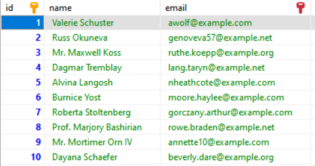
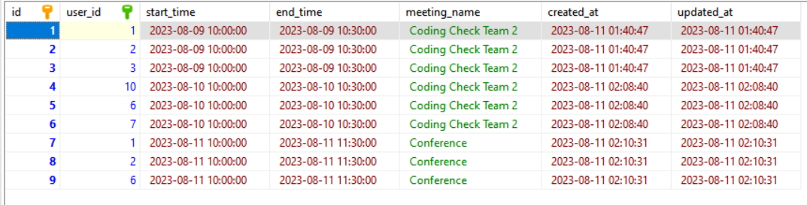

## Meeting Scheduling Coding Test

To get the best I decided to create a small [Laravel](https://laravel.com) project and see how to implement the test with the Framework

## The endpoint

```php
Route::post('create-meeting', [MeetingsController::class, 'scheduleMeeting']);
```
## The request for data validation

```php
    /**
     * Get the validation rules that apply to the request.
     *
     * @return array<string,mixed>
     */
    public function rules()
    {
        return [
            'user_ids' => 'required|array',
            'user_ids.*' => 'exists:users,id', //validate that each user exists in the database
            'start_time' => 'required|date_format:Y-m-d H:i:s',
            'end_time' => 'required|date_format:Y-m-d H:i:s|after:start_time',
            'meeting_name' => 'required|string|max:100', 
        ];
    }
```

I validate the existence of each user id in the database because I added a couple of example records.



## The most important, the engine of the functionality

Here is the code:

```php
    /**
     * Schedule a meeting validating conflicts
     *
     * @param MeetingRequest $request
     * @return mixed
     */
    public function scheduleMeeting(MeetingRequest $request)
    {
        $validated = $request->validated();

        $meetingCollision = Meeting::find($validated['user_ids'])
                                    ->where('start_time', '>=', Carbon::createFromFormat('Y-m-d H:i:s', $validated['start_time']))
                                    ->where('end_time', '<=', Carbon::createFromFormat('Y-m-d H:i:s', $validated['end_time']))
                                    ->first();
        if ($meetingCollision) { //validate meeting collision by user ids
            return response()->json([
                'result' => "User {$meetingCollision->user_id} has a conflicting meeting: {$meetingCollision->meeting_name}",
            ], Response::HTTP_BAD_REQUEST);
        }

        foreach($validated['user_ids'] as $user_id) { //create the meeting for each user
            Meeting::create([
                'user_id' => $user_id,
                'start_time' => $validated['start_time'],
                'end_time' => $validated['end_time'],
                'meeting_name' => $validated['meeting_name']
            ]);
        }

        return response()->json([
            'result' => 'The meeting has been successfully booked.',
        ], Response::HTTP_CREATED);
    }
```

## Validations

- Data is required
```json
{
    "user_ids": [
        "The user ids field is required."
    ],
    "start_time": [
        "The start time field is required."
    ],
    "end_time": [
        "The end time field is required."
    ],
    "meeting_name": [
        "The meeting name field is required."
    ]
}
```

- All the users exist in the database
```json
{
    "user_ids.2": [
        "The selected user_ids.2 is invalid."
    ]
}
```

- One or more users have a meeting conflict 
```json
{
    "result": "User 1 has a conflicting meeting: Coding Check Team 2"
}
```

- DateTime format validation
```json
{
    "start_time": [
        "The start time does not match the format Y-m-d H:i:s."
    ]
}
```

- Meeting span
```json
{
    "end_time": [
        "The end time must be a date after start time."
    ]
}
```

- Meeting booked
```json
{
    "result": "The meeting has been successfully booked."
}
```

## Example Request

```json
{
    "user_ids" : [1,2,6],
    "start_time" : "2023-08-11 10:00:00",
    "end_time" : "2023-08-11 11:30:00",
    "meeting_name" : "Conference"
}
```

Meeting stored
